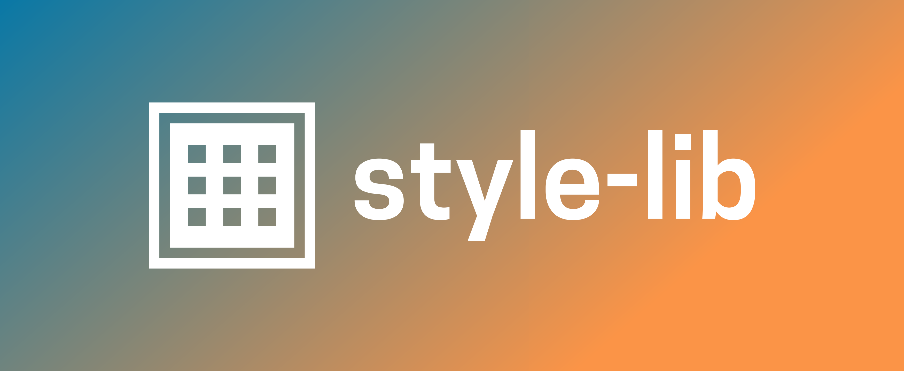

<br/>
<p align="center">
  <a href="https://github.com/wgd3/@nx-fullstack/style-lib">
    
  </a>
  <br>
  <small>
    <i>Create a custom, shared style library for your monorepo!</i>
  </small>

  <p align="center">
    <a href="https://github.com/@nx-fullstack/style-lib">
      Explore the docs 📘
    </a>
    <a href="https://github.com/@nx-fullstack/style-lib">View Demo 🖥</a>
    <a href="https://github.com/@nx-fullstack/style-lib/issues">Report Bug 🐛</a>
    <a href="https://github.com/@nx-fullstack/style-lib/issues">Request Feature 🧰</a>
  </p>
</p>

     [](http://commitizen.github.io/cz-cli/) [](https://github.com/semantic-release/semantic-release) [](https://github.com/prettier/prettier)

## Table Of Contents

- [About the Project](#about-the-project)
- [Built With](#built-with)
- [Getting Started](#getting-started)
  - [Prerequisites](#prerequisites)
  - [Installation](#installation)
- [Usage](#usage)
- [Roadmap](#roadmap)
- [Contributing](#contributing)
- [License](#license)
- [Authors](#authors)
- [Acknowledgements](#acknowledgements)

## Built With

This section should list any major frameworks that you built your project using. Leave any add-ons/plugins for the acknowledgements section. Here are a few examples.

- [Nx](https://nx.dev)
- [Stylelint](https://github.com/stylelint/stylelint)

### Installation

#### NPM

```shell
npm install @nx-fullstack/style-lib
```

#### Yarn

```shell
yarn add @nx-fullstack/style-lib
```

## Usage

#### Add a new style library to your repo

```shell
nx g @nx-fullstack/style-lib:init
```

#### Integrating your style library with an existing Angular application

```shell
nx g @nx-fullstack/style-lib:ng-add
```

## Roadmap

See the [open issues](https://github.com/wgd3/@nx-fullstack/style-lib/issues) for a list of proposed features (and known issues).

<!-- ### Creating A Pull Request

1. Fork the Project
2. Create your Feature Branch (`git checkout -b feature/AmazingFeature`)
3. Commit your Changes (`git commit -m 'Add some AmazingFeature'`)
4. Push to the Branch (`git push origin feature/AmazingFeature`)
5. Open a Pull Request -->

## License

Distributed under the MIT License. See [LICENSE](https://github.com/wgd3/@nx-fullstack/style-lib/blob/main/LICENSE.md) for more information.

## Contributors ✨

Thanks goes to these wonderful people ([emoji key](https://allcontributors.org/docs/en/emoji-key)):

<!-- ALL-CONTRIBUTORS-LIST:START - Do not remove or modify this section -->
<!-- prettier-ignore-start -->
<!-- markdownlint-disable -->
<table>
  <tbody>
    <tr>
      <td align="center" valign="top" width="14.28%"><a href="https://thefullstack.engineer/"><br /><sub><b>Wallace Daniel</b></sub></a><br /><a href="https://github.com/@nx-fullstack/style-lib/commits?author=wgd3" title="Code">💻</a></td>
    </tr>
  </tbody>
</table>

<!-- markdownlint-restore -->
<!-- prettier-ignore-end -->

<!-- ALL-CONTRIBUTORS-LIST:END -->

This project follows the [all-contributors](https://github.com/all-contributors/all-contributors) specification. Contributions of any kind welcome!

## Acknowledgements

- [ImgShields](https://shields.io/)
